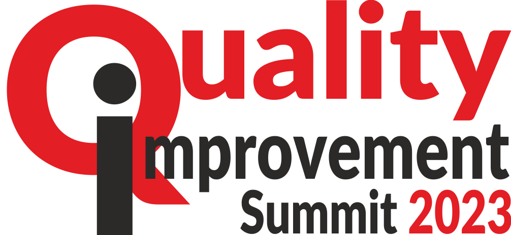

<a name="readme-top"></a>

<div align="center">

 <!-- LOGO -->

  
  <br/>

<!-- MAIN HEADING -->

  <h3><b>Quiality Improvement Summit 2023</b></h3>

</div>

<!-- TABLE OF CONTENTS -->
# 📗 Table of Contents

- [📖 About the Project](#about-project)
  - [🛠 Built With](#built-with)
    - [Tech Stack](#tech-stack)
    - [Key Features](#key-features)
  - [🚀 Live Demo](#live-demo)
- [💻 Getting Started](#getting-started)
  - [Setup](#setup)
  - [Prerequisites](#prerequisites)
  - [Install](#install)
  - [Usage](#usage)
  - [Run tests](#run-tests)
  - [Deployment](#deployment)
- [👥 Authors](#authors)
- [🔭 Future Features](#future-features)
- [🤝 Contributing](#contributing)
- [⭐️ Show your support](#support)
- [🙏 Acknowledgements](#acknowledgements)
- [❓ FAQ (OPTIONAL)](#faq)
- [📝 License](#license)

<!-- INTRO -->
# 📖 Quality Improvement Summit 2023 <a name="about-project"></a>

> This is a website about Quality Improvement Summit 2023 organised by Encarta Change Managers Incorporated. The event aims at bringing individuals from different disciplines who are all passionate about Quality in all aspects of human endeavour.

> Watch this [Video](https://www.loom.com/share/4a2c119a3ce944cc8bb1beefbd2ff119) to learn more about the project.

## 🛠 Built With <a name="built-with"></a>
1. HTML
2. CSS
3. JavaScript
### Tech Stack <a name="tech-stack"></a>

> Tech Stack to be updated soon

<details>
  <summary>Client</summary>
  <ul>
    <li><a href="https://reactjs.org/">HTML</a></li>
    <li><a href="https://reactjs.org/">CSS</a></li>
    <li><a href="">JavaScript</a></li>
  </ul>
</details>

<!-- Features -->

### Key Features <a name="key-features"></a>

> - Dekstop view for the Home page
> - Mobile view for the Home page
> - Desktop view for the About page
> - Mobile view for the About page
> - Collapsing/Expanding of speakers list in Mobile view
> - Automation of Hamburger menu in Mobile
> - Dynamic creation of speakers using JavaScript

<p align="right">(<a href="#readme-top">back to top</a>)</p>

<!-- LIVE DEMO -->

LIVE DEMO

> [Visit live page of the Quality Improvement Summit 2023](https://anyars-encarta.github.io)

<p align="right">(<a href="#readme-top">back to top</a>)</p>

<!-- GETTING STARTED -->

## 💻 Getting Started <a name="getting-started"></a>

> To get a local copy up and running, follow these steps.
### Prerequisites

1. A Browser (Preferably Google Chrome)
2. A Code Editor
3. Internet Connection
4. Git

<!-- SETUP -->
### Setup

Clone this repository to your desired folder using:

```sh
  cd my-folder
  git clone https://github.com/anyars-encarta/First-Capstone.git
```
<!-- INSTALL -->

### Install

Install this project with the latest version of Git and a code editor.

### Usage

To run the project, follow the link below:
> [Visit live page of the Quality Improvement Summit 2023](https://anyars-encarta.github.io)
### Deployment

You can deploy this project using:
>1. A Code Editor
>2. Latest version of Git

<p align="right">(<a href="#readme-top">back to top</a>)</p>

<!-- AUTHORS -->
## 👥 Authors <a name="authors"></a>

👤 **Anyars Yussif**

- GitHub: [@anyars-encarta](https://github.com/anyars-encarta)
- Twitter: [@anyarsencarta](https://twitter.com/anyarsencarta)
- LinkedIn: [LinkedIn](https://www.linkedin.com/in/anyars-yussif-1a179769/)


<p align="right">(<a href="#readme-top">back to top</a>)</p>

## 🔭 Future Features <a name="future-features"></a>

- [ ] **Portal to join the Summit**
- [ ] **Portal to book Tickets**
- [ ] **Portal for news**
- [ ] **Portal to sponsor the event**
- [ ] **Portal for QI Campaign**
- [ ] **Portal for Scheduling Event**

<p align="right">(<a href="#readme-top">back to top</a>)</p>

<!-- CONTRIBUTION -->
## 🤝 Contributing <a name="contributing"></a>

Contributions, issues, and feature requests are welcome!

<p align="right">(<a href="#readme-top">back to top</a>)</p>

<!--SUPPORT -->

## ⭐️ Show your support <a name="support"></a>

> If you like this project, please give it some starts ⭐️⭐️⭐️⭐️⭐️

<p align="right">(<a href="#readme-top">back to top</a>)</p>

<!-- ACKNOWLEDGEMENTS -->
## 🙏 Acknowledgments <a name="acknowledgements"></a>

> Special acknowledgement to [Creative Commons](https://www.behance.net/gallery/29845175/CC-Global-Summit-2015) for the design inspiration and [microverseinc](https://github.com/microverseinc) for the design materials.

<p align="right">(<a href="#readme-top">back to top</a>)</p>

<!-- FAQS -->
## ❓ FAQ (OPTIONAL) <a name="faq"></a>

- **What is the venue for event?**

  - The venue for this year's event is the International Conference Centre, Accra, Ghana, West Africa.

- **How many sessions will the event have?**

  - The event is scheduled to take place from 25th - 28th July, 2023 with 2 sessions per day.

<p align="right">(<a href="#readme-top">back to top</a>)</p>

<!-- LICENSE -->

## 📝 License <a name="license"></a>

This project is [MIT](./LICENSE) licensed.

<p align="right">(<a href="#readme-top">back to top</a>)</p>